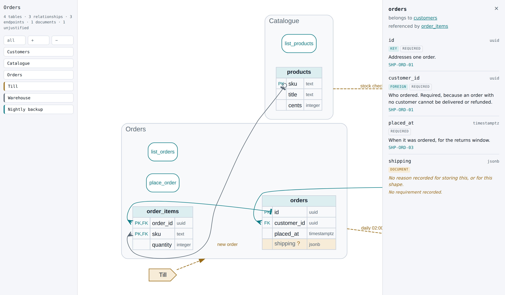

# schemacase

*Every column makes its case.*

**[Live demo](https://drfritzi.github.io/schemacase/)**, rendered from [`example/shop.json`](example/shop.json).

[](https://drfritzi.github.io/schemacase/)

Turns a **data-model spec** into one self-contained HTML page: a single diagram of the whole
model — every store with every column, the operations that reach them, the systems around them,
and the data crossing between — that you can pan, zoom and click through.

The renderer has no database driver, no server client and no knowledge of any particular
project; everything it draws arrives in a single JSON file, the same way a renderer for an
OpenAPI document only ever sees the document. The spec lives in the project it describes, the
picture is made here. To start a spec from what already exists, the [importers](#start-from-an-existing-schema)
read a Postgres database or a Prisma schema.

```
project (owns the data)                   schemacase (owns the picture)
  import / write by hand  ──►  model.json  ──►  render  ──►  model.html
```

## Use

```bash
npx schemacase docs/model.json                                   # writes docs/model.html
npx schemacase docs/model.json -o out.html
npx schemacase docs/model.json --proposal docs/proposed.json
```

Or install it (`npm i -D schemacase`) and call `schemacase` from a script. Node 22 or later.

Or as a library — note it is async, because Graphviz lays the diagram out while the page is
built rather than in the reader's browser:

```js
import { renderHtml } from "schemacase";
writeFileSync("model.html", await renderHtml(JSON.parse(readFileSync("model.json", "utf8"))));
```

See [`example/shop.json`](example/shop.json) for a complete spec, and `pnpm example` to render it.

## The page

The page *is* the diagram: it fills the window, and everything else is chrome. Drag to pan, the
wheel zooms, and the rail on the left flies to an area or a system. Clicking a store, an
operation or a system opens it in the panel beside the canvas; a store's relationships are
clickable there too, so you can walk the model without hunting for the next box.

Relationships are drawn column to column — a foreign key runs from the column that holds it to
the column it references, with crow's foot at the many end and a bar, or a circle for "may be
absent", at the one end.

Graphviz does the layout when the page is written, so the output carries a finished picture
rather than a layout engine: a few hundred KB, and no network at any point.

## The spec

One JSON object. `schemacase: 1` is the version and is required; everything else is optional and
falls back to a neutral default, so a spec can start small and grow.

| key | what it is |
|---|---|
| `title` | the window's name and the first line of the rail |
| `collectionsLabel`, `operationsLabel` | what you call the two kinds of thing — *tables*, *endpoints*, whatever fits |
| `collections[]` | `{ name, fields: [{ name, type, key, required, document, why, usedBy }] }` |
| `fieldNotes` | `{ "collection.field": { why, usedBy }, "*.field": { … } }` — the case for a column, stated once; see below |
| `links[]` | `{ from, to, via, strong, optional }` — `via` names the foreign-key columns, `strong` means the child does not outlive its parent, `optional` that it may exist without one |
| `operations[]` | `{ name, summary, inputs: [{ name, type, required }] }` |
| `groups[]` | `{ name, blurb, collections: [], operations: [] }` — the editorial grouping |
| `systems[]` | `{ name, kind, blurb }` — `kind` is `external`, `internal` or `store` |
| `flows[]` | `{ from, to, label }` — either end may name a system, a group or a single collection |

`groups` becomes the areas on the canvas. A collection nobody groups is still drawn, in an area
of its own called out as unplaced — grouping is a judgement, and the page says when one is
missing rather than hiding the table.

`systems` and `flows` are the half nothing can introspect: a database cannot say who calls it.
They are written by hand, and they are what turns a schema picture into a system picture.

### The case for a column

`why` and `usedBy` on a field are the case for it existing: why the value is kept at all and in
this shape, and which requirement needs it. Neither is defaulted to anything reassuring — a column
with neither is marked `?` on the canvas, says so in the panel, and is counted in the rail. That
count is the work list. A schema nobody can justify column by column is a schema nobody decided.

### Stating a reason once: `fieldNotes`

Some columns are structural: `tenant_id`, `created_at`, `project_id` carry the same reason in
every table they appear in. Writing that reason into every field is one chance per table to
disagree, so a spec may state it once:

```json
{
  "schemacase": 1,
  "fieldNotes": {
    "*.tenant_id": { "why": "Scopes every row to one shop.", "usedBy": ["SHP-TEN-01"] },
    "orders.status": { "why": "Where the parcel is, as the customer sees it.", "usedBy": ["SHP-ORD-03"] }
  },
  "collections": [ "…" ]
}
```

A key is either exact (`orders.status`) or a column name across every collection (`*.tenant_id`).
The exact key wins over the wildcard, and whatever the field says itself wins over both. An empty
`why` or `usedBy` on the field counts as unsaid, so a note fills in an imported spec whose columns
all start out empty — which makes `fieldNotes` the natural place to keep the authored half when
the collections are re-generated from a database.

A spec that cannot be drawn is rejected with the reason (`unknown collection "x"`,
`unsupported version 2`) rather than rendered half-way.

### Vocabulary

*Collection*, *field*, *link*, *operation*, *group*, *system*, *flow* — deliberately domain-free.
A collection is often a database table and an operation often an API endpoint, but nothing here
assumes it, which is what lets one renderer serve several projects. Use `collectionsLabel` /
`operationsLabel` to put your own words on the page.

## Start from an existing schema

```bash
npx schemacase import prisma prisma/schema.prisma -o docs/model.json
npx schemacase import postgres "$DATABASE_URL" --schema public -o docs/model.json
```

Without `-o` the spec is printed. The Postgres importer reads tables, columns, primary keys and
foreign keys from the catalogue and needs the [`pg`](https://www.npmjs.com/package/pg) package
next to schemacase (`npm i -D pg`); it is an optional peer dependency, so rendering never
installs a driver. The Prisma importer reads models, scalar fields, `@id` / `@@id` and
`@relation(fields: …)`; relation fields without `fields` are the other side of a link, not a
column.

Every imported column arrives with an empty `why` and `usedBy`. That is the point: a database can
say what is stored, never why, so the first page you render is the complete work list. Keep the
authored half in [`fieldNotes`](#stating-a-reason-once-fieldnotes) and it survives the next import.

Nullable foreign keys become `optional` links, `ON DELETE CASCADE` (`onDelete: Cascade`) becomes
`strong`, and `json`/`jsonb` columns (Prisma: `Json` and composite types) are marked `document`.

As a library: `importPostgres({ connectionString, schema })` from `schemacase/import/postgres`
(async) and `importPrisma(source)` from `schemacase/import/prisma`.

## Reviewing a proposed change

Pass a second spec with `--proposal` and the page gains a **Proposals** button in the rail. The
second file carries a `changes` list — one entry per decision, each with an id, a title, why, and
the collections, fields and operations it touches:

```json
{
  "schemacase": 1,
  "changes": [
    {
      "id": "P1",
      "title": "Shipping address as a column",
      "why": "A document holding exactly one field.",
      "cost": "A migration of every open order.",
      "affects": { "collections": ["orders"], "fields": ["orders.shipping", "orders.ship_to"] }
    }
  ],
  "collections": [ "…the proposed model…" ]
}
```

The change list is authored; the before-and-after under each card is computed by diffing the two
specs. Anything in that diff no card accounts for is printed as **Unaccounted for**, so a
proposal cannot carry along what nobody agreed to. A change that lists fields must list the ones
it *adds* as well as the ones it removes — otherwise its card shows deletions only and reads as
data loss.

### In a pull request

The same review works outside the page. `schemacase diff` prints it as Markdown:

```bash
npx schemacase diff docs/model.json docs/proposed.json                         # to stdout
npx schemacase diff docs/model.json docs/proposed.json --fail-on-unaccounted   # exit 1 on smuggled changes
```

And the GitHub Action posts it on every pull request that changes the model, as one comment it
keeps up to date across pushes:

```yaml
# .github/workflows/model-review.yml
on:
  pull_request:
    paths: ["docs/model.json"]

permissions:
  contents: read
  pull-requests: write

jobs:
  review:
    runs-on: ubuntu-latest
    steps:
      - uses: actions/checkout@v4
      - uses: DrFritzi/schemacase@v0
        with:
          spec: docs/model.json
          fail-on-unaccounted: true
```

The spec on the pull request's base commit is compared with the spec in the pull request. Put the
`changes` list in the spec itself (entries already on the base commit count as settled and are
not shown again), or point `proposal:` at a separate proposal file. Any change to
the model that no entry accounts for is listed under **Unaccounted for**, and with
`fail-on-unaccounted` the check fails. A spec the pull request creates is compared against an
empty one.

| input | default | |
|---|---|---|
| `spec` | — | path to the spec in the repository |
| `proposal` | the spec | a separate proposal file to compare against the base spec |
| `base` | the pull request's base commit | any commit to compare against |
| `comment` | `true` | post or update the pull-request comment |
| `fail-on-unaccounted` | `false` | fail the step on unaccounted changes |
| `token` | `github.token` | needs `pull-requests: write` |

Outputs: `changed`, `unaccounted` (a count), `review-file` (the Markdown). The review also goes to
the job summary. The action runs on the runner's own Node and installs nothing.

## Develop

```bash
pnpm install
pnpm quicktest     # lint + tests, a few seconds
pnpm example       # render example/shop.json
```
